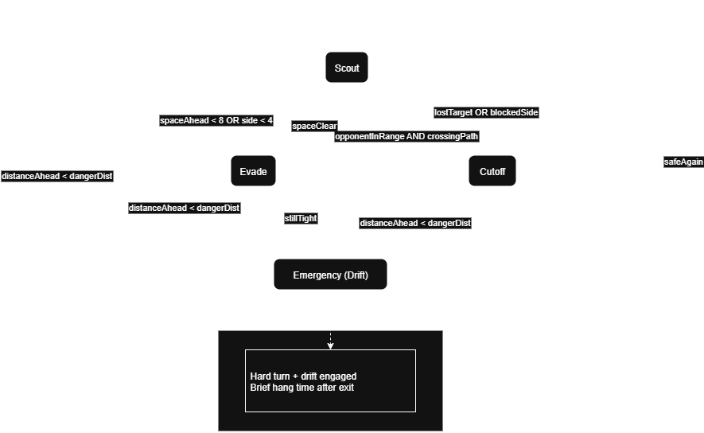

# Phaseline

Phaseline is a retro-inspired hoverbike arena game developed for CISC 486 (Game Development).  
It features PSX-style graphics, fast-paced movement, glowing trails, portals, and power-ups.  
Players must outmaneuver rivals to be the last bike standing.

## Gameplay Overview
- Competitive multiplayer arena battles (2–4 players online).  
- Hoverbikes leave glowing trails that eliminate on contact.  
- Sharp 90° turns for classic arcade handling.  
- Portals teleport bikes across the arena while conserving momentum.  
- Power-ups provide temporary advantages (boost, trail immunity, laser attack).  
- Anti-gravity mechanics allow bikes to stick to walls/ceilings until a boost or jump breaks adhesion.  
- NPC AI enemies (FSM + decision-making) provide challenge in single-player or hybrid matches.  

## AI Design
**Finite State Machine (FSM)**

The AI bot controlling enemy hoverbikes uses a **Finite State Machine** (FSM) to balance aggression, survival, and navigation.  
Each bot continuously analyzes space around it using **spherecasts** (forward, side, and diagonal probes).  
Depending on sensor readings and nearby opponents, the bot transitions between four main states:

### **States**
- **Scout:**  
  Default behavior. The bot moves forward constantly, scanning for open space and avoiding trails/walls using forward and side probes.  
  It chooses gentle turns toward the roomiest direction.

- **Evade:**  
  Triggered when an obstacle or wall is close on any side. The bot performs sharp avoidance maneuvers to steer back into open space.  
  Prioritizes survival over chasing targets.

- **Emergency:**  
  Activated when an obstacle or wall is dangerously close in front.  
  The bot executes a **hard drift turn** with maximum steering force and temporary drift mode for a tighter carve to escape.  
  Drift continues for a short “hang time” after exiting Emergency.

- **Cutoff:**  
  When an opponent is within range and crossing the bot’s trajectory, the bot turns to intercept or “cut off” their path.  
  If blocked or out of range, returns to **Scout** or **Evade**.

---

### **FSM Diagram**

**Decision-Making / Pathfinding:** NPCs decide whether to chase, cut off, use portals, or grab power-ups.  

## Scripted Events
- Portals activating/deactivating at set intervals.  
- Randomly timed power-up spawns.  
- Arena shrinks after every quarter of round, forcing players inward.
- Retro glitch/destabilization effects to intensify endgame phases.  

## Environments and Assets
- PSX-inspired low-poly models and pixelated textures for hoverbikes and arenas (created  in Blender).  
- Up to 4 different arenas/maps to select from.
- [Sci-fi effects](https://assetstore.unity.com/packages/vfx/particles/sci-fi-arsenal-60519) for trails, portals and power-ups.  
- [Sci-Fi weapons](https://assetstore.unity.com/packages/audio/sound-fx/weapons/sci-fi-weapons-pack-1-218039) sound effects.
- Synthwave soundtracks with escalating intensity. 

## Team Plan
- **Shahbaaz Siddiqui** (solo developer):  
  - Core gameplay (bike controller, trails, portals, anti-gravity).  
  - AI design (FSM, decision-making).  
  - Power-ups and scripted events.  
  - Networking integration (Unity Netcode for GameObjects).  
  - 3D models.
  - Documentation.  

## Additional Goals
- Laser weapon as an additional attack option.  
- Local split-screen multiplayer.  
- Arena variants (loops, vertical surfaces, portal-heavy maps). 

## Gameplay Videos
FSM: https://youtu.be/14jkTXgq2Fs
Pathfinding + Decision-making: https://youtu.be/na4aE98YMPQ

